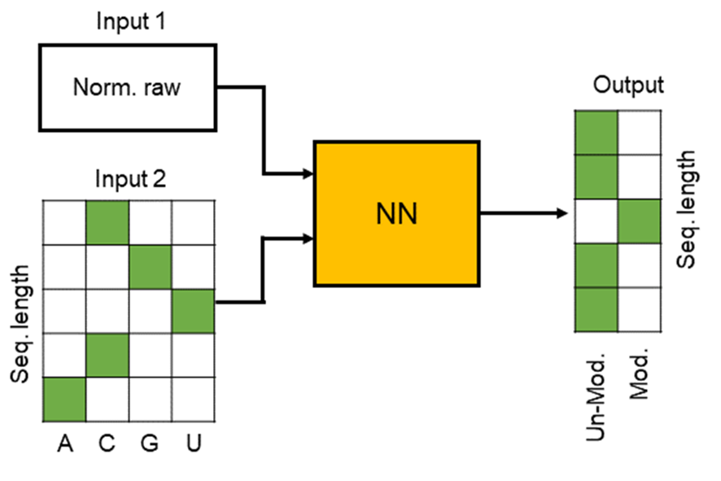

# PseudoDeC_RMaP

PseudoDeC is a deep neural network tool created for the RMaP challenge to identify pseudouridine modification.

# Requirements

PseudoDeC was created using:

     python == 3.10.9
     TensorFlow == 2.10 (Native Windows)
     pyqt5
     scikit-image
     matplotlib
     numpy
     pysam
     Bio
     h5py
     
# Protocol

Here you can find the step to follow for running the PseudoDeC and to obtain a "Final_analysis.npz" file that contains the modification frequency of pseudouridine
on the reference positions. Results can be plotted after loading the "Final_analysis.npz" and load the "reference_frequency" using the .file() function of .npz files.

1) The first step for running PseudoDeC is to analyze the fasta5 files using Tombo. it is necessary for extracting signal-to-sequence information
and resquiggle the data.

2) run the python file "Create_fulllength_testdata_from_tombo.py". Before running the file, there are a few variables to set at the beginning of
   the Python script here listed:

         
     2.1) save_path
   
     2.2) multi_fast5_path
   
     2.3) .bam file path

     .bam file is necessary to obtain reference information. This file can be obtained after basecalling.

4) run the "NN_prediction_fromlongread.py" file. this will analyze the data created after running "Create_fulllength_testdata_from_tombo.py". Also here, there are a few variables
   to set in the "NN_prediction_fromlongread.py" file:
   3.1 ) path1 = path where the data are saved after running "Create_fulllength_testdata_from_tombo.py".
   3.2 ) save_path
   3.3 ) reference_path (file must be a .fasta file)

   after running "NN_prediction_fromlongread.py", a "Final_analysis.npz" file is created. The file contains the analysis of the files, which consists of the modification frequency
   on the reference positions.

# Collaboration

This work is a collaboration partnership with the group of Prof. Dr. Susanne Gerber, Uni Medical Center, Mainz. https://csg.uni-mainz.de/group-member/susanne-gerber/
